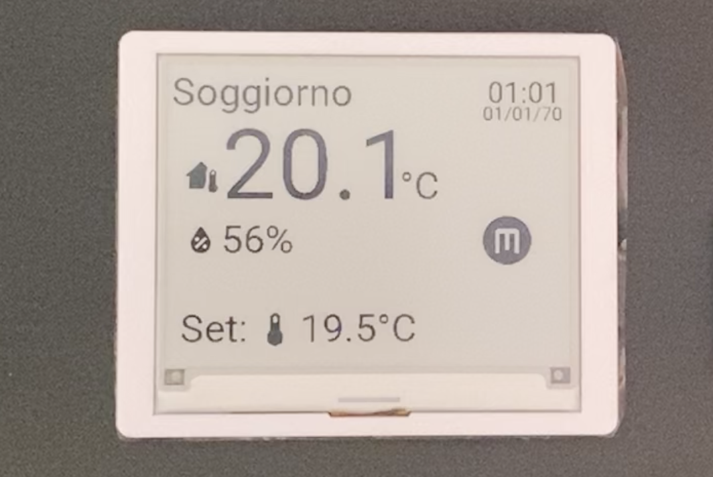
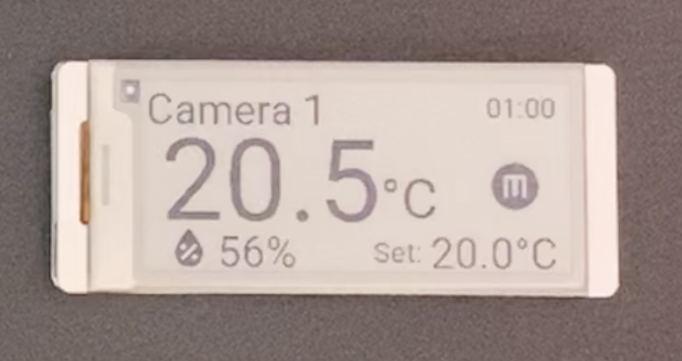

# Esp epaper display
This repository contains the [ESPHome](https://esphome.io) configuration code for programming the [Elecrow ESP32-based 4.2-inch epaper display](https://www.elecrow.com/crowpanel-esp32-4-2-e-paper-hmi-display-with-400-300-resolution-black-white-color-driven-by-spi-interface.html) and [2.9-inch](https://www.elecrow.com/crowpanel-esp32-2-9-e-paper-hmi-display-with-128-296-resolution-black-white-color-driven-by-spi-interface.html) I've used.

The project implements a single page view to show the room temperature and room humidity, with the possibility to change a set room temperature by using the buttons on the display. The above data is taken from HomeAssistant instance.

The dispaly will be mounted in a wall and used as a radiator room control panel interacting with [HomeAssistant](https://www.home-assistant.io).

## Table of contents
- [Features](#features)
  - [Images](#images)
  - [Modes](#modes)
- [Code](#code)
- [Future implementations](#future-implementations)
- [Contribution](#contribution)
- [License](#license)

## Features
You can find a well detailed decoumentation on EspHome on the following links that will better help you to understand the example code:
- https://esphome.io/components/display/
- https://esphome.io/components/display/waveshare_epaper/#configuration-variables

### Images
Since an image explain more then 1000 words, here below you can see a bad quality photo for each display:
- 4.2 ePaper dispaly
 
- 2.9 ePaper dispaly


On top left we have the room name.
On top right we have the hour (and the date for 4.2inch).
On the middle left we have the room temperature and room humidity soon below.
On the middle right we have the [mode](#modes) circle.
On the button we have the room temperature set.

### Modes
We have 3 different modes available:
- **Automatic (A)**: HomeAssistant automations will change the set temperature based on the day of the week and hour of the day.
- **Manual (M)**: the set temperature will be the one chosen manually from the dispaly or the HomeAssistant UI.
- **Off (O)**: the radiator won't activate no matter the temperature of the room.

Stay tuned for the actual implementation of the above features in HA.

## Code
The ESPHome configuration is located in `examples folder`. Respectively for [4.2 display](examples/4.2-epaper.yaml) and [2.9 dispaly](examples/2.9-epaper.yaml). It defines the behavior of the disply, including global variables and integration with sensors and actuators.

The 4.2inch epaper dispaly of Elecrow is not yet supported in EspHome. For this reason an external component needs to be added:
```
external_components:
  - source: github://pr#6209
    components: [ waveshare_epaper ]
```

## Future implementations
Here listed are availables future ideas that will be implemented in the epaper display:
- **DHT22 sensor addition**. A DHT22 sensor will be added to the screen to monitor the temperature and himidity of the room in which the screen will be mounted. Currently those values are retrieved thanks to a [costum esp room thermometer](https://github.com/zioCristia/esp-room-thermometer).
- **Radiator control**. Thanks to HomeAssistant I'll hanable the functionalites displayed to activate the room radiator if we have a lower room set temperature.

## Contribution
Feel free to report any bugs or feature requests.

## License
This project is licensed under the [MIT License](./LICENSE). See the `LICENSE` file for details.